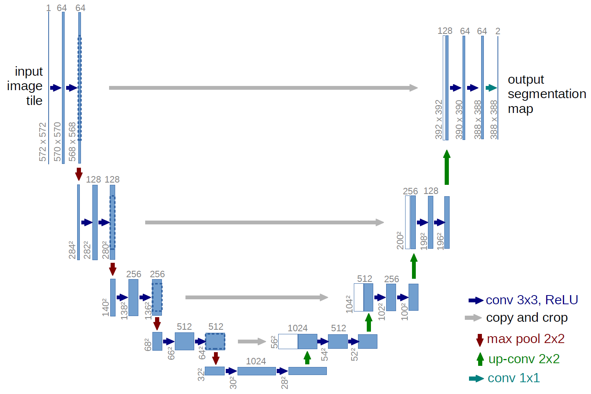

# Brain Tumor Segmentation using 3D UNet and Variants

## Guidelines

### Code
All code will be written in the src folder.

## Commits

Always create a new branch to add new work, and then merge it using merge/pull request option to merge with master. This is to encounter less merge conflicts.

## Useful Links

- [Markdown Cheatsheet](https://github.com/adam-p/markdown-here/wiki/Markdown-Cheatsheet)
- [ImageDataGenerator tutorial](https://vijayabhaskar96.medium.com/tutorial-image-classification-with-keras-flow-from-directory-and-generators-95f75ebe5720)
- [ImageDataGenerator tutorial - TF website](https://www.tensorflow.org/api_docs/python/tf/keras/preprocessing/image/ImageDataGenerator#flow)
- [ImageDataGenerator tutorial flow function - SO](https://stackoverflow.com/questions/57185851/correct-usage-of-imagedatagenerator-flow-function)

## Related papers' repositories

- 

### Important Papers

- 3D U-Net Based Brain Tumor Segmentation and Survival Days Prediction, 2019, Wang et al. -> crap
- [Brain Tumor Segmentation Using an Ensemble of 3D U-Nets and Overall Survival Prediction Using Radiomic Features](https://www.frontiersin.org/articles/10.3389/fncom.2020.00025/full)
  - They ensembled 6 3DUNets with different number of layers, they split the data 6:4, hence I do the same splits

### Datasets
- [BraTS 2020 (Test + Validation sets)](https://www.kaggle.com/datasets/awsaf49/brats20-dataset-training-validation?resource=download)
  - Multi-modal scans available as NIfTI images .nii
  - Four channels of information - four different volumes of the same image
    - T1/Native
    - T1CE/ post-contrast T1-weighted (same as first one but contrasted)
    - T2 Weighted
    - T2 Fluid attenuated inversion recovery volumes/ FLAIR
  - Labels/Annotations
    - 0: unlabeled volume: the background and parts of the brain which is normal
    - 1: Necrotic and Non-enhancing tumor core (NCR/NET)
    - 2: Peritumoral Edema (ED)
    - 4: GD-enhancing tumor (ET)
  - 

#### Report

Dataset stuff:

- Download dataset and unzip + install nibabel (Shayan)
- (FIX) Rename W39_1998.09.19_Segm -> BraTS20_Training_355_seg (Shayan)
- MinMax Scaler + Combine all volumes except for T1 native as T1 Native is the same as T1CE with worse contrast (Shayan)
- label 4 -> 3 (Shayan)
- Crop images and remove most of the black section (Shayan)
- (Extra) Drop volumes where there's not much annotation?? (Did not do this as there's not many images, to just lose one!)
- 

Code stuff:

- wrote data loader and dataset 
- wrote and debug 3DUNet
- TODO: add dice or focal loss or both, and train (shayan)
- Going with BCEwithLogit to see how it works

## Metrics
- Dice Coefficient
- Accuracy
- ...

#### Models

For segmentation, variations of 3D Unet is being used, namely 3DUNet (Concatenative skips), Residual 3DUNet (Additive skips), Attention 3DUNet

